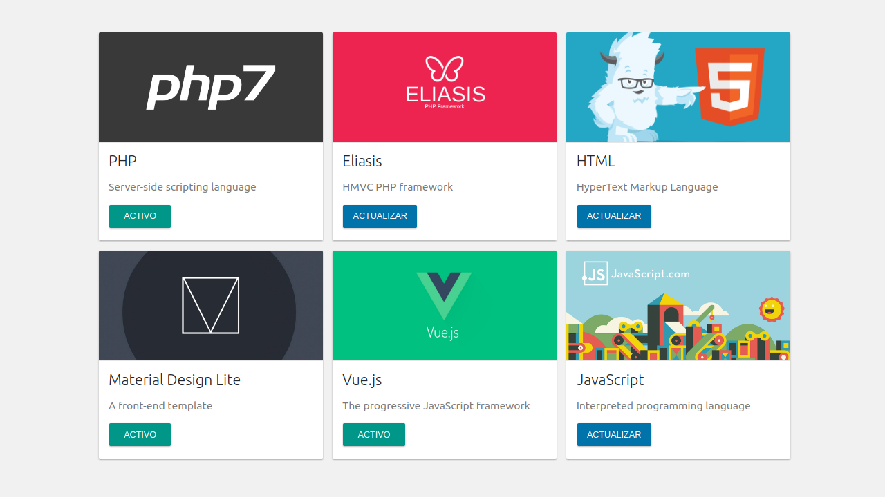

# Complement PHP library for Eliasis Framework

[](https://packagist.org/packages/eliasis-framework/complement) [](https://packagist.org/packages/eliasis-framework/complement) [](https://packagist.org/packages/eliasis-framework/complement) [](https://packagist.org/packages/eliasis-framework/complement)

[English version](README.md)

Librería PHP para agregar adición de complementos (componentes, plugins, módulos, plantillas) en Eliasis Framework.

---

- [Instalación](#instalación)
- [Requisitos](#requisitos)
- [Cómo empezar y ejemplos](#cómo-empezar-y-ejemplos)
- [Métodos disponibles](#métodos-disponibles)
- [Imágenes](#imagenes)
- [Uso](#uso)
- [Tests](#tests)
- [Manejador de excepciones](#manejador-de-excepciones)
- [Contribuir](#contribuir)
- [Repositorio](#repositorio)
- [Licencia](#licencia)
- [Copyright](#copyright)

---

<p align="center"><strong>Vista de los complementos (Módulos)</strong></p>

<p align="center">
  <a href="https://youtu.be/EJi_TXa28Mc" title="Echa un vistazo al código">
  	
  </a>
</p>

---

### Instalación 

La mejor forma de instalar esta extensión es a través de [composer](http://getcomposer.org/download/).

Para instalar PHP Hook library, simplemente escribe:

    $ composer require eliasis-framework/Complement

El comando anterior sólo instalará los archivos necesarios, si prefieres descargar todo el código fuente (incluyendo tests, directorio vendor, excepciones no utilizadas, documentos...) puedes utilizar:

    $ composer require eliasis-framework/Complement --prefer-source

También puedes clonar el repositorio completo con Git:

	$ git clone https://github.com/eliasis-framework/Complement.git

### Requisitos

Esta biblioteca es soportada por versiones de PHP 5.6 o superiores y es compatible con versiones de HHVM 3.0 o superiores.

### Cómo empezar y ejemplos

Para utilizar esta biblioteca, simplemente:

```php
require __DIR__ . '/vendor/autoload.php';
```

### Métodos disponibles

Métodos disponibles en esta biblioteca:

```php
use Eliasis\Complement\Type\Component;

Component::getInstance();
Component::run();
Component::load();
Component::getInfo();
Component::script();
Component::style();
Component::exists();
Component::getLibraryPath();
Component::getLibraryVersion();
Component::render();

Component::Identifier()->set();
Component::Identifier()->get();
Component::Identifier()->instance();
Component::Identifier()->getAction();
Component::Identifier()->setAction();
Component::Identifier()->doAction();
Component::Identifier()->hasNewVersion();
Component::Identifier()->getRepositoryVersion();
Component::Identifier()->install();
Component::Identifier()->remove();
Component::Identifier()->setState();
Component::Identifier()->changeState();
Component::Identifier()->getState();
Component::Identifier()->getStates();
```

```php
use Eliasis\Complement\Type\Plugin;

Plugin::getInstance();
Plugin::run();
Plugin::load();
Plugin::getInfo();
Plugin::script();
Plugin::style();
Plugin::exists();
Plugin::getLibraryPath();
Plugin::getLibraryVersion();
Plugin::render();

Plugin::Identifier()->set();
Plugin::Identifier()->get();
Plugin::Identifier()->instance();
Plugin::Identifier()->getAction();
Plugin::Identifier()->setAction();
Plugin::Identifier()->doAction();
Plugin::Identifier()->hasNewVersion();
Plugin::Identifier()->getRepositoryVersion();
Plugin::Identifier()->install();
Plugin::Identifier()->remove();
Plugin::Identifier()->setState();
Plugin::Identifier()->changeState();
Plugin::Identifier()->getState();
Plugin::Identifier()->getStates();
```

```php
use Eliasis\Complement\Type\Module;

Module::getInstance();
Module::run();
Module::load();
Module::getInfo();
Module::script();
Module::style();
Module::exists();
Module::getLibraryPath();
Module::getLibraryVersion();
Module::render();

Module::Identifier()->set();
Module::Identifier()->get();
Module::Identifier()->instance();
Module::Identifier()->getAction();
Module::Identifier()->setAction();
Module::Identifier()->doAction();
Module::Identifier()->hasNewVersion();
Module::Identifier()->getRepositoryVersion();
Module::Identifier()->install();
Module::Identifier()->remove();
Module::Identifier()->setState();
Module::Identifier()->changeState();
Module::Identifier()->getState();
Module::Identifier()->getStates();
```

```php
use Eliasis\Complement\Type\Template;

Template::getInstance();
Template::run();
Template::load();
Template::getInfo();
Template::script();
Template::style();
Template::exists();
Template::getLibraryPath();
Template::getLibraryVersion();
Template::render();

Template::Identifier()->set();
Template::Identifier()->get();
Template::Identifier()->instance();
Template::Identifier()->getAction();
Template::Identifier()->setAction();
Template::Identifier()->doAction();
Template::Identifier()->hasNewVersion();
Template::Identifier()->getRepositoryVersion();
Template::Identifier()->install();
Template::Identifier()->remove();
Template::Identifier()->setState();
Template::Identifier()->changeState();
Template::Identifier()->getState();
Template::Identifier()->getStates();
```

### Imágenes




### Uso

- Una vez instalada, la biblioteca se cargará automáticamente desde el core de Eliasis Framework.

- [ ] Pendiente

### Tests 

- [ ] Pendiente

### Manejador de excepciones

Esta biblioteca utiliza [control de excepciones](src/Exception) que puedes personalizar a tu gusto.
### Contribuir
1. Comprobar si hay incidencias abiertas o abrir una nueva para iniciar una discusión en torno a un fallo o función.
1. Bifurca la rama del repositorio en GitHub para iniciar la operación de ajuste.
1. Escribe una o más pruebas para la nueva característica o expón el error.
1. Haz cambios en el código para implementar la característica o reparar el fallo.
1. Envía pull request para fusionar los cambios y que sean publicados.

Esto está pensado para proyectos grandes y de larga duración.

### Repositorio

Los archivos de configuración de este repositorio se crearon y subieron automáticamente con [Reposgit Creator](https://github.com/Josantonius/BASH-Reposgit).

### Licencia

Este proyecto está licenciado bajo **licencia MIT**. Consulta el archivo [LICENSE](LICENSE) para más información.

### Copyright

2017 Josantonius, [josantonius.com](https://josantonius.com/)

Si te ha resultado útil, házmelo saber :wink:

Puedes contactarme en [Twitter](https://twitter.com/Josantonius) o a través de mi [correo electrónico](mailto:hello@josantonius.com).