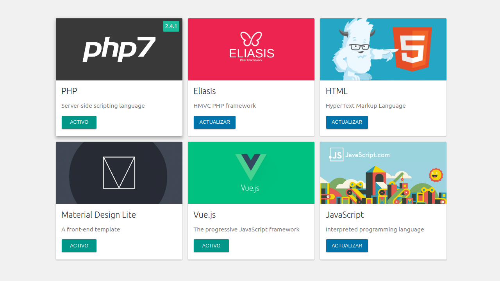
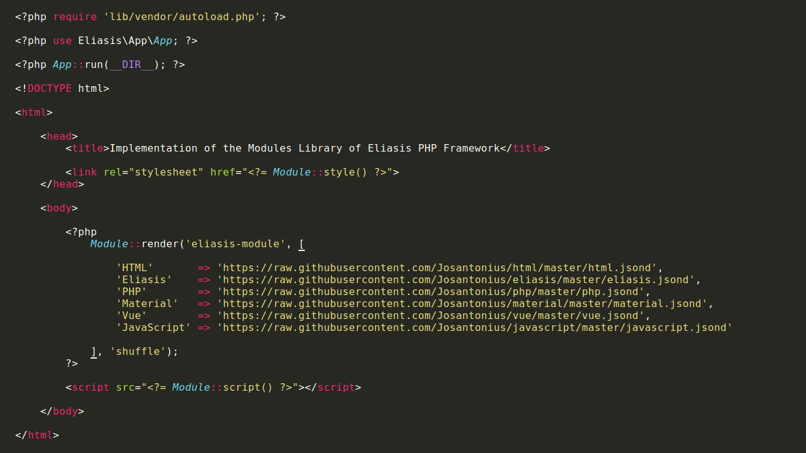

# Module PHP library for Eliasis Framework

[](https://packagist.org/packages/eliasis-framework/module) [](https://packagist.org/packages/eliasis-framework/module) [](https://packagist.org/packages/eliasis-framework/module) [](https://packagist.org/packages/eliasis-framework/module)

[Versión en español](README-ES.md)

PHP library for adding addition of modules for Eliasis Framework.

---

- [Installation](#installation)
- [Requirements](#requirements)
- [Quick Start and Examples](#quick-start-and-examples)
- [Available Methods](#available-methods)
- [Images](#images)
- [Usage](#usage)
- [Tests](#tests)
- [Exception Handler](#exception-handler)
- [Contribute](#contribute)
- [Repository](#repository)
- [License](#license)
- [Copyright](#copyright)

---

<p align="center"><strong>Modules view</strong></p>

<p align="center">
  <a href="https://youtu.be/EJi_TXa28Mc" title="Take a look at the code">
  	
  </a>
</p>

---

### Installation

The preferred way to install this extension is through [composer](http://getcomposer.org/download/).

To install PHP Module library, simply:

    $ composer require eliasis-framework/Module

The previous command will only install the necessary files, if you prefer to download the entire source code (including tests, vendor folder, exceptions not used, docs...) you can use:

    $ composer require eliasis-framework/Module --prefer-source

Or you can also clone the complete repository with Git:

	$ git clone https://github.com/eliasis-framework/Module.git
	
### Requirements

This library is supported by PHP versions 5.6 or higher and is compatible with HHVM versions 3.0 or higher.

### Quick Start and Examples

To use this class, simply:

```php
require __DIR__ . '/vendor/autoload.php';

use Eliasis\Module\Module;
```

### Available Methods

Available methods in this library:

```php
Module::getInstance();
Module::loadModules();
Module::loadModule();
Module::getModulesInfo();
Module::script();
Module::style();
Module::exists();
Module::getLibraryPath();
Module::getLibraryVersion();
Module::render();

Module::Identifier()->setModule();
Module::Identifier()->set();
Module::Identifier()->get();
Module::Identifier()->instance();
Module::Identifier()->getAction();
Module::Identifier()->setAction();
Module::Identifier()->doAction();
Module::Identifier()->hasNewVersion()` method.
Module::Identifier()->getRepositoryVersion()` method.
Module::Identifier()->install()` method.
Module::Identifier()->remove()` method.
Module::Identifier()->setState()` method.
Module::Identifier()->changeState()` method.
Module::Identifier()->getState()` method.
Module::Identifier()->getStates()` method.
```

### Images






### Usage

- The library will be loaded automatically from the Eliasis Framework core.
 
- [ ] Pending

### Tests

- [ ] Pending

### Exception Handler

This library uses [exception handler](src/Exception) that you can customize.

### Contribute
1. Check for open issues or open a new issue to start a discussion around a bug or feature.
1. Fork the repository on GitHub to start making your changes.
1. Write one or more tests for the new feature or that expose the bug.
1. Make code changes to implement the feature or fix the bug.
1. Send a pull request to get your changes merged and published.

This is intended for large and long-lived objects.

### Repository

All files in this repository were created and uploaded automatically with [Reposgit Creator](https://github.com/Josantonius/BASH-Reposgit).

### License

This project is licensed under **MIT license**. See the [LICENSE](LICENSE) file for more info.

### Copyright

2017 Josantonius, [josantonius.com](https://josantonius.com/)

If you find it useful, let me know :wink:

You can contact me on [Twitter](https://twitter.com/Josantonius) or through my [email](mailto:hello@josantonius.com).